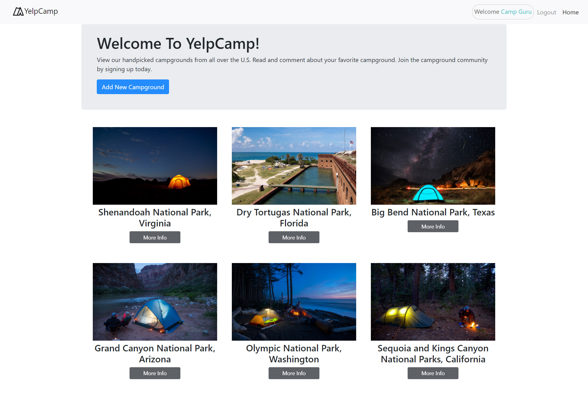
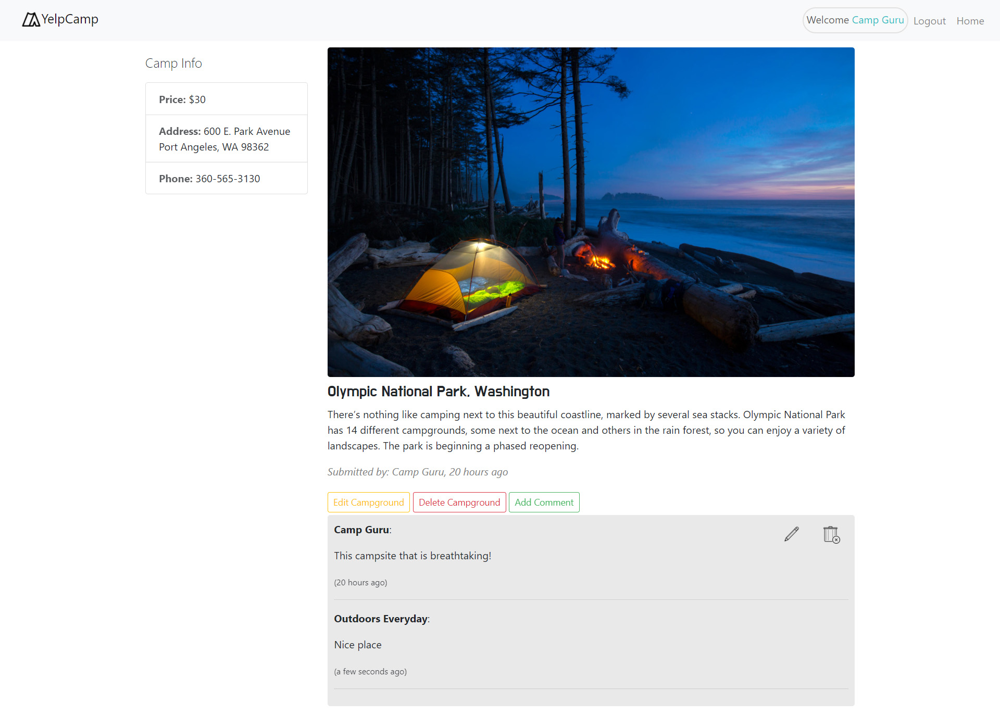
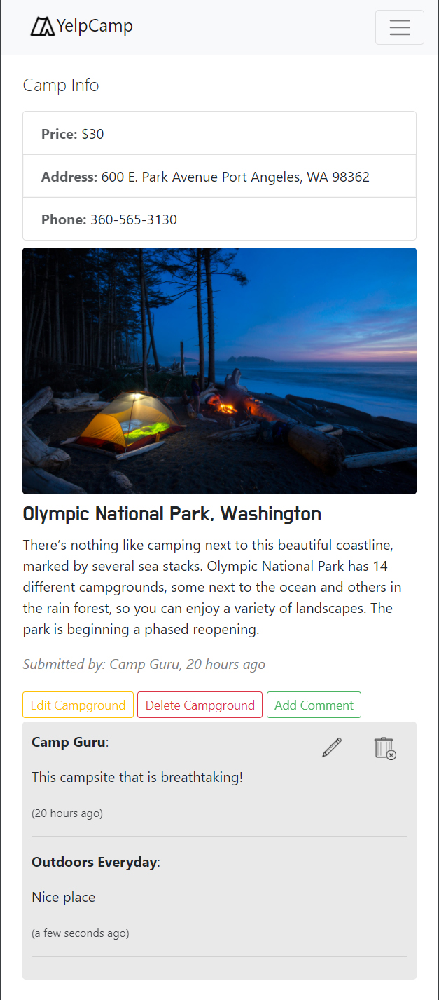

# **YelpCamp** [(Live Demo)](https://infinite-hamlet-12958.herokuapp.com/)

<table>
  <tr style="padding: 0">
    <td style="padding-right:5px"  width="59%"><h4>Landing Page</h4></td>
    <td style="padding-right:5px" width="50%"><h4>Index Page</h4></td>
</table>

<table>
  </tr>
    <tr style="padding: 0">
    <td style="padding-right:5px" width="60%"><h4>Show Page</h4></td>
    <td style="padding-right:5px" width="20%"><h4>Show Page on Mobile</h4></td>
  </tr>
</table>

---

**Node Packages**
* express
* ejs
* bodyParser
* mongoose   
* connect-flash      
* passport 

---

**Comment Routs**
- INDEX    /campgrounds        GET 
- NEW      /campgrounds/new    GET
- CREATE   /campgrounds        POST
- SHOW     /campgrounds/:id    GET
  
**for comments**
- NEW      /campgrounds/:id/comments/new    GET
- CREATE   /campgrounds/:id/comments        POST

---

## version 3
    remove YC and seed new YC, 
    show comments, 
    seperate campgrounds schema, 
    introduce module.exports

## version 4
    moved index, new, show .ejs to views/campgrounds/
    created new.ejs in views/comments/
    changed paths in routs to refelect files in views/campgrounds
    added comments new, show page and connected them relating camps

## version 5 
    comments styling
    added sidebar
    stying of show camp page, custom stylesheet 'main.css'

## version 6 
    authentication
    changed to bootstrap v4.5.3
    adding comments requires log in
    hide show login, signup, logout in navbar
    middleware func for username li in navbar

## version 7
    refactored routes (seperate files)
    app.use("/campgrounds", campgroundRoutes);
    replaced "/campground" -> "/" in campgrounds.js
    added mergeParams to router = express.Router({mergeParams: true});
    created readme.md file

## version 8
    associating comments to users
    comment.js - added id, username to author obj
    removed author field in Add a comment page
    prevent an anauthenticated user from creating a campground
    save username+id to newly created campground
    
## version 9
    added destroy route
    added delete  
    hide/show edit and delete buttons button
    added edit comment route
    added delete comment route
    user can only edit, delete their campgrounds
    refactored middleware

## version 10
    added flash messages to let the user know of success/errors
    landing page image slider (5 images with opacity animation)
    dynamic price feature

## version 11
    ui improvements
    - login, signup page
    - navbar-link highlight
    - hide comments div when there are no comments
    - rearranged 'Welcome User'
    - input changed to textarea for description, comment

    added price, addresss, phone to left col on show page
    created helper function to add dashes to phone number
    added created since time (Moment JS)
    
## version 12
    eliminated the use of var
    changed regular js functions to es6 arrow functions
    deployed to heroku

